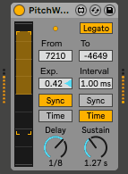

# PitchW curve Max for Live MIDI Effect

## Download
https://maxforlive.com/library/device/6327/pitchw-curve 
See [releases](https://github.com/h1data/M4L-pitchw-curve/releases) for older versions.

## What is this?
A simple MIDI effect for Ableton Live which generates pitch bend message curves with note on. 
Suitable for bending down synth percussion sounds in drum rack.

Based on the device [PitchW ADSR](https://maxforlive.com/library/device/3904/pitchw-adsr) by LAEX with additional features.

## Parameters
- `From` Adjusts the initial pitch bend value at note on.
- `To` Adjust the target value of the pitch bend curve.
- `Exp.` (Exponent) Adjusts exponent value for pitch bend curve.
1.00: linear, over 1.00: exponential, below 1.00: logarithmic.
- `Delay mode` Switches the sustain time mode between beat synced and time-based.
- `Delay time` Adjusts delay time to start pitch bend curve from note on in note length or milliseconds.
- `Sustain mode` Switches the sustain time mode between beat synced and time-based.
- `Sustain time` Adjusts the duration of pitch bend curve in note length or milliseconds.
- `Legato` When enabled, the curve wouldn't start with note on while playing at least one note. Suitable for playing with poly notes.
- `Pitch Bend Monitor` Displays the range and the current value of pitch bend. Dragging bracket shapes changes the range. 
Shift+drag can adjust finely. Cmd/ctrl+drag changes in 25 steps (+/- 12 steps and zero). 
129 steps with shift+cmd/ctrl (+/- 64 steps and zero).

## Precautions for use and known issues
See [issues](https://github.com/h1data/M4L-pitchw-curve/issues?q=).
